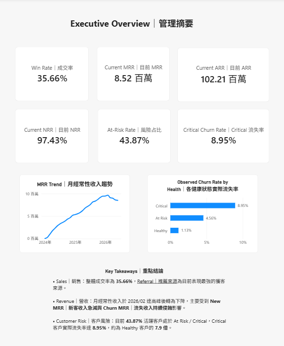
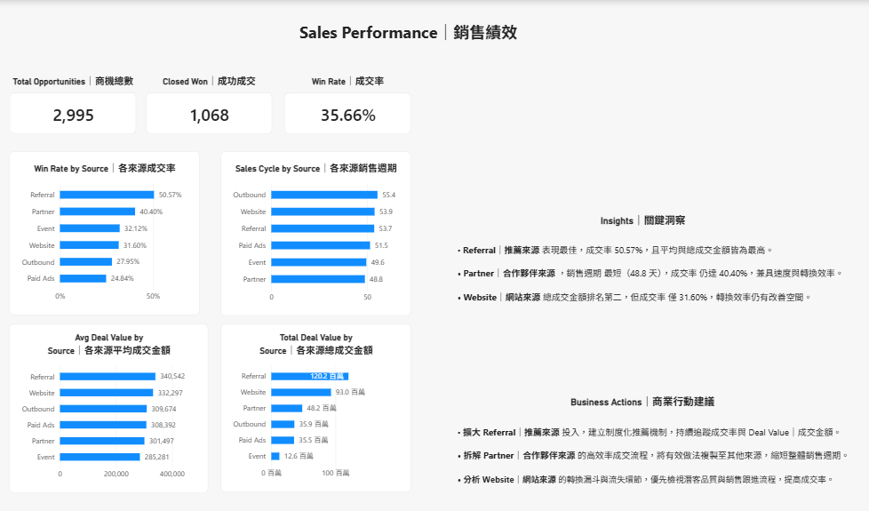
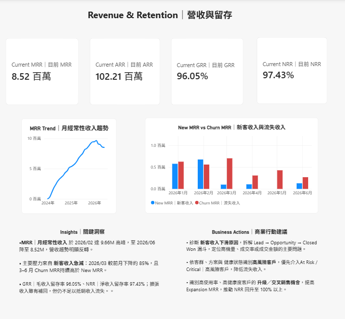
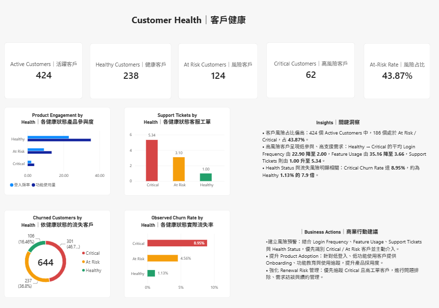

# B2B SaaS Revenue Operations Analytics

## Project Overview

This project simulates a B2B SaaS business and builds an end-to-end Revenue Operations analytics workflow to evaluate sales pipeline performance, revenue growth, customer retention, and customer health.

The project integrates MySQL, SQL, Python, and Power BI to transform business data into actionable insights for Revenue Operations and management decision-making.

## Tech Stack

- MySQL — Database management and relational data modeling
- SQL — Business analysis and KPI calculation
- Python — Synthetic dataset generation and data validation
- Power BI — Data visualization and interactive dashboard

## Business Problem

A B2B SaaS company needs a unified view of its revenue lifecycle, from lead generation and sales conversion to recurring revenue and customer retention.

The analysis focuses on identifying growth opportunities and revenue risks across the customer lifecycle.

## Analysis Objectives

- Evaluate lead and sales pipeline performance
- Compare conversion performance across lead sources and customer segments
- Track MRR growth and recurring revenue movements
- Analyze expansion, contraction, and churn impact
- Monitor customer health and identify accounts at risk
- Support data-driven Revenue Operations decisions

## Dataset & Data Model

The project uses a synthetic B2B SaaS dataset covering the full customer lifecycle from lead generation to recurring revenue and product usage.

| Table | Rows | Description |
|---|---:|---|
| Leads | 10,000 | Lead source, company profile, and qualification data |
| Opportunities | 2,995 | Sales opportunities, stages, deal values, and outcomes |
| Accounts | 1,068 | Converted customer accounts and account status |
| Subscriptions | 1,068 | SaaS plans, contract terms, fees, and subscription status |
| Monthly Revenue | 17,972 | Monthly MRR movements including expansion, contraction, and churn |
| Product Usage | 17,972 | Customer engagement, active users, feature usage, and support activity |

### Customer Lifecycle

`Lead → Opportunity → Account → Subscription → Revenue / Product Usage`

Data relationships were validated through primary and foreign key checks to maintain referential integrity across the analytical model.

## Key Metrics & KPI Framework｜核心指標

The analysis focuses on Revenue Operations KPIs across sales performance, recurring revenue, retention, and customer health.

### Sales & Pipeline

- Qualified Leads
- Win Rate
- Sales Conversion
- Performance by Lead Source, Segment, and Industry

### Revenue

- Monthly Recurring Revenue (MRR)
- Annual Recurring Revenue (ARR)
- Expansion MRR
- Contraction MRR
- Churn MRR

### Retention

- Gross Revenue Retention (GRR)
- Net Revenue Retention (NRR)
- Customer Churn
- Customer Retention

### Customer Health

- Active Accounts
- Customer Health Status
- Active Users
- Login Frequency
- Feature Usage
- Support Tickets

## Key Findings｜關鍵分析結論

- **Referral was the highest-performing lead source**, achieving a 50.57% win rate, significantly outperforming outbound and paid acquisition channels.
- **Win rates were relatively consistent across customer segments**, with Enterprise at 36.20%, SMB at 35.58%, and Mid-market at 35.52%, suggesting that lead source quality had a stronger impact on conversion than company size.
- **Monthly Recurring Revenue (MRR) showed strong growth**, increasing from 15,107 in January 2024 to 8,517,286 by June 2026 as the customer base expanded.
- **Customer churn emerged as a major revenue risk**, with 644 churned accounts versus 424 active accounts in the final dataset.
- The combined sales, revenue, retention, and product-usage analysis highlights the need to balance acquisition growth with stronger customer retention and health management.

## Business Recommendations｜商業建議

- **Prioritize high-converting acquisition channels**, especially Referral and Partner sources, while continuing to evaluate their scalability and lead quality.
- **Review lower-performing Outbound and Paid Ads channels** by examining targeting quality, acquisition efficiency, and downstream conversion performance.
- **Make customer retention a RevOps priority**, as the high volume of churned accounts indicates that acquisition growth alone may not support sustainable recurring revenue growth.
- **Establish a proactive customer health workflow** using active users, login frequency, feature usage, and support activity to identify at-risk accounts before churn occurs.
## Power BI Dashboard｜儀表板展示

The Power BI dashboard consists of four analytical views covering executive performance, sales, revenue retention, and customer health.

### 1. Executive Overview｜管理摘要



### 2. Sales Performance｜銷售績效



### 3. Revenue & Retention｜營收與留存



### 4. Customer Health｜客戶健康



## Repository Structure｜專案結構


```text
B2B-SaaS-RevOps-Analytics/
├── dashboard/
│   └── NovaFlow_RevOps_Analytics.pbix
├── data/
│   ├── accounts.csv
│   ├── leads.csv
│   ├── monthly_revenue.csv
│   ├── opportunities.csv
│   ├── product_usage.csv
│   └── subscriptions.csv
├── docs/
│   └── 02_dataset_spec.md
├── screenshots/
│   ├── 01_executive_overview.png
│   ├── 02_sales_pipeline.png
│   ├── 03_revenue_retention.png
│   └── 04_customer_health.png
├── scripts/
│   └── generate_dataset.py
├── sql/
│   ├── 01_database_setup.sql
│   └── 02_business_analysis.sql
└── README.md


```
## Data Quality & Validation｜資料品質與驗證

The dataset was validated before analysis to ensure consistency across revenue logic, customer status, product usage, and table relationships.

Key validation checks included:

- MRR formula consistency
- Post-churn revenue logic
- Product usage validity
- Active user consistency
- Last login consistency
- Subscription-to-Account foreign key validation
- Revenue-to-Account foreign key validation
- Product Usage-to-Account foreign key validation
- Opportunity-to-Lead foreign key validation
- Opportunity-to-Account logic validation

All final validation checks returned **0 errors**.

## Project Workflow｜專案流程

1. Generate a synthetic B2B SaaS dataset using Python
2. Load and structure relational data in MySQL
3. Validate data quality, business logic, and table relationships
4. Perform SQL-based business analysis and KPI calculations
5. Connect Power BI to the MySQL database
6. Build dashboards for sales, revenue, retention, and customer health
7. Translate analytical findings into business recommendations

## Skills Demonstrated｜能力證據

- Relational database design and data modeling
- SQL querying and business KPI analysis
- Data quality validation and referential integrity checks
- Synthetic dataset generation using Python
- Revenue Operations KPI framework design
- Power BI dashboard development
- Sales pipeline and conversion analysis
- MRR, ARR, GRR, NRR, and churn analysis
- Customer health and retention analysis
- Translation of analytical findings into business recommendations

## Project Notes｜專案說明

- This project uses synthetic data created for portfolio and analytical demonstration purposes.
- No real customer, company, or confidential business data is included.
- The dataset and business scenarios were designed to simulate common B2B SaaS Revenue Operations use cases.
- The project focuses on demonstrating end-to-end analytical thinking, from data generation and validation to business insight and dashboard communication.